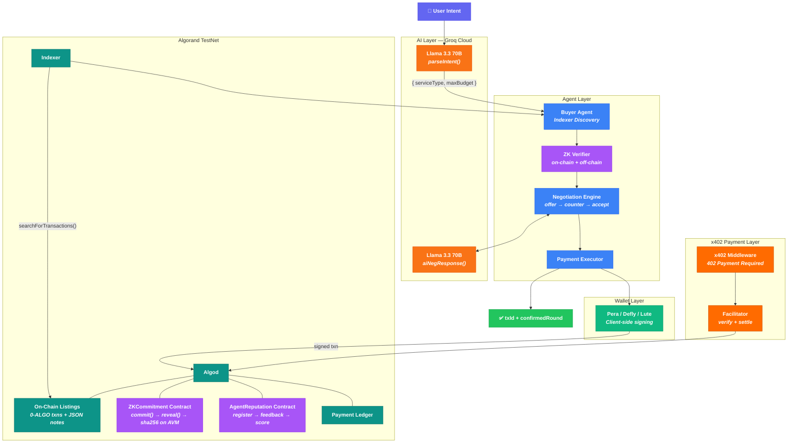
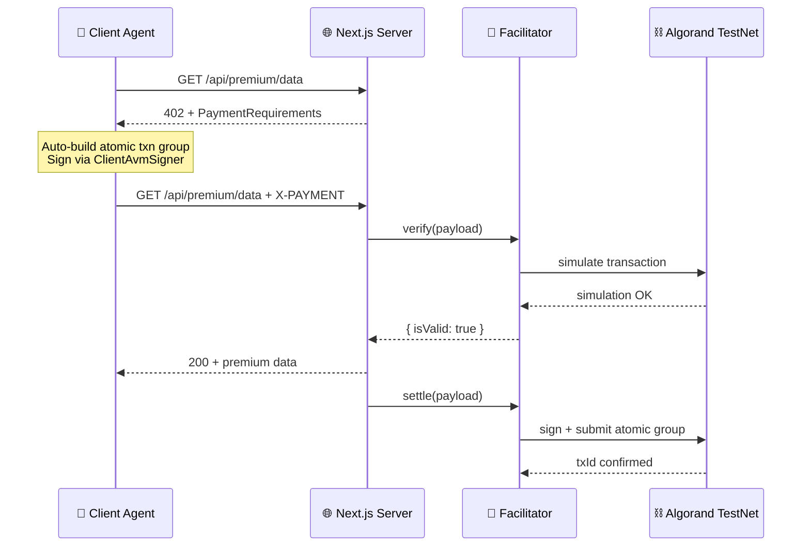
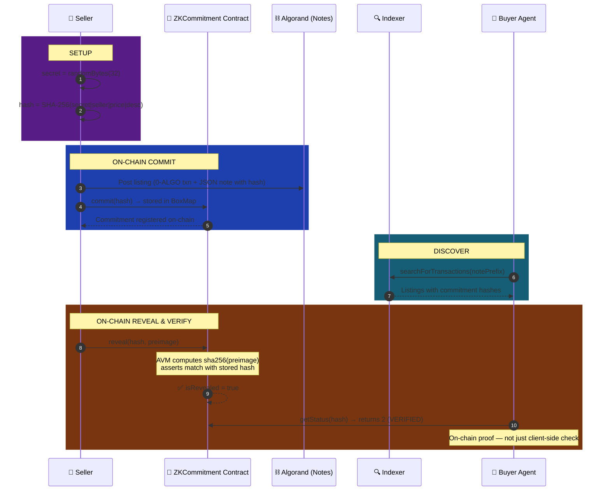
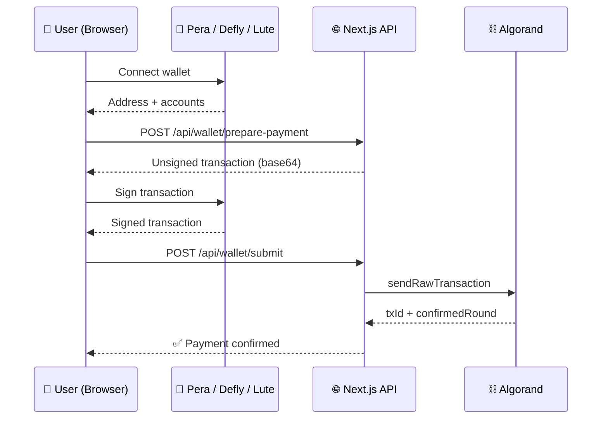

<p align="center">
  
  
  
  
  
  
  
</p>

<h1 align="center">A2A Agentic Commerce Framework</h1>

<p align="center">
  <strong>Autonomous AI agents that discover, negotiate, and transact on Algorand — with on-chain ZK verification, x402 payment protocol, and wallet authentication.</strong>
</p>

<p align="center">
  <code>npx tsx scripts/run.ts "Buy cloud storage under 1 ALGO"</code>
</p>

<p align="center">
  x402 Protocol &nbsp;·&nbsp; On-Chain ZK (SHA-256 via AVM) &nbsp;·&nbsp; Indexer Discovery &nbsp;·&nbsp; Pera / Defly / Lute Wallets &nbsp;·&nbsp; AI Negotiation &nbsp;·&nbsp; Real Payments
</p>

---

## Why This Exists

Digital commerce is human-bottlenecked. Every purchase — cloud storage, API access, GPU compute — requires a person to search, compare, negotiate, and pay. As AI agents become autonomous actors, there's no infrastructure for **machines to trustlessly transact with each other**.

**A2A Agentic Commerce** is the full pipeline:

```
User says "Buy cloud storage" → AI parses intent → Indexer discovers on-chain listings
→ ZK commitment verified ON-CHAIN by AVM → Agents negotiate via x402 protocol
→ Wallet signs payment → Real ALGO transferred → Done.
```

> **One-liner**: Autonomous agents discover services on Algorand, verify seller authenticity via on-chain SHA-256, negotiate prices with LLMs, and execute real payments — all without human intervention.

---

## Highlights

### x402 Payment Protocol for Autonomous Agents

Real integration with [x402-avm](https://x402.goplausible.xyz/) by GoPlausible. Premium API endpoints return `402 Payment Required` — agents automatically sign Algorand transactions, and the public facilitator verifies + settles on-chain with fee abstraction. This is how autonomous agents pay for services: HTTP-native, no human approval.

### On-Chain ZK Verification (not just off-chain hashing)

A dedicated **ZKCommitment smart contract** (App ID `757481776` on TestNet) stores commitment hashes on-chain via BoxMap. When sellers reveal their preimage, the **AVM's native `sha256` opcode** recomputes the hash on-chain and asserts it matches. The verification is cryptographically enforced by the blockchain, not just a client-side check.

### Wallet Authentication (Pera, Defly, Lute)

Users connect their wallet via `@txnlab/use-wallet-react` v4. Payment transactions are prepared server-side as unsigned txns, signed by the wallet client-side, and submitted back. No private keys on the server for user transactions.

### Algorand Indexer Discovery

Buyer agents query the Algorand Indexer by `notePrefix` and seller address to discover listings directly from the blockchain. No off-chain databases. Every listing is a confirmed 0-ALGO transaction with a verifiable `txId`.

### ERC-8004 Reputation Registry (on Algorand)

An on-chain **AgentReputation** smart contract (App ID `757478982` on TestNet) tracks agent scores, feedback counts, and active status — inspired by Ethereum's ERC-8004 Trustless Agents standard, adapted natively for the AVM with BoxMap storage.

---

## System Architecture



---

## x402 Protocol Integration

The framework uses the real **x402 HTTP payment protocol** — developed by Coinbase, extended to Algorand by [GoPlausible](https://x402.goplausible.xyz/).



| Component | Package | Role |
|:----------|:--------|:-----|
| **Core SDK** | `@x402-avm/core` | Client, server, facilitator primitives |
| **AVM Scheme** | `@x402-avm/avm` | Algorand exact payment scheme, CAIP-2 |
| **Fetch Wrapper** | `@x402-avm/fetch` | `wrapFetchWithPayment()` — auto 402 handling |
| **Facilitator** | `facilitator.goplausible.xyz` | Public TestNet payment settlement |

---

## On-Chain ZK Commitment Scheme

Unlike typical off-chain hash verification, this uses a **dedicated smart contract** where the AVM executes `sha256` natively.



### Contract Methods (App `757481776`)

| Method | Args | What it does |
|:-------|:-----|:-------------|
| `commit(bytes<32>)` | Commitment hash | Stores hash in BoxMap |
| `reveal(bytes<32>, bytes)` | Hash + preimage | AVM runs `sha256(preimage)`, asserts match |
| `getStatus(bytes<32>)` | Hash | Returns 0/1/2 (not found / committed / verified) |

### Cryptographic Properties

| Property | Guarantee |
|:---------|:----------|
| **Binding** | Seller cannot change claims post-commit (SHA-256 collision resistance) |
| **Hiding** | On-chain hash reveals nothing without the 32-byte random nonce |
| **On-chain enforcement** | Verification is executed by the AVM, not trusted client code |

---

## Wallet Integration



Supported wallets via `@txnlab/use-wallet-react` v4:

| Wallet | Type | Best For |
|:-------|:-----|:---------|
| **Pera** | Mobile + Web | Most popular Algorand wallet |
| **Defly** | Mobile | DeFi-focused with portfolio tracking |
| **Lute** | Browser extension | Desktop-first experience |

---

## Pipeline Stages

| # | Stage | What Happens |
|:--|:------|:-------------|
| 1 | **Connect** | Connects to Algorand TestNet (Algonode public nodes) |
| 2 | **Fund Accounts** | Creates buyer + 5 seller ephemeral accounts |
| 3 | **Post Listings** | 0-ALGO self-txns with JSON notes + SHA-256 commitment hash |
| 3b | **ZK Commit** | Each commitment hash registered on ZKCommitment contract |
| 4 | **AI Parse Intent** | Groq LLM extracts serviceType, maxBudget from natural language |
| 5 | **Indexer Discovery** | Queries Algorand Indexer by notePrefix + seller address |
| 6 | **Negotiate** | AI-powered offer → counter → accept rounds (x402-style messages) |
| 7 | **Select Best Deal** | Picks cheapest accepted deal |
| 7b | **ZK Reveal** | Seller reveals preimage → AVM verifies SHA-256 on-chain |
| 8 | **Execute Payment** | Real ALGO transfer, returns txId + confirmedRound |
| 9 | **x402 Summary** | Protocol details, CAIP-2 network, facilitator info |

---

## Tech Stack

| Layer | Technology | Purpose |
|:------|:-----------|:--------|
| **Blockchain** | Algorand TestNet | On-chain listings, payments, ZK verification |
| **Smart Contracts** | Algorand TypeScript (PuyaTs) | ZKCommitment + AgentReputation contracts |
| **x402 Protocol** | `@x402-avm/core`, `@x402-avm/avm`, `@x402-avm/fetch` | HTTP 402 payment gating, fee abstraction |
| **Facilitator** | `facilitator.goplausible.xyz` | Payment verification + settlement |
| **Wallet** | `@txnlab/use-wallet-react` v4 | Pera, Defly, Lute wallet integration |
| **SDK** | `algosdk` v3 + `algokit-utils` v8 | Transactions, Indexer, account management |
| **AI / LLM** | Groq (Llama 3.3 70B) | Intent parsing, negotiation responses |
| **Frontend** | Next.js 15, React 19, Tailwind CSS 4 | Web dashboard with wallet auth |
| **Language** | TypeScript 5.8 (strict) | End-to-end type safety |

---

## Project Structure

```
a2a-commerce/
├── contracts/
│   ├── ZKCommitment.algo.ts          # On-chain ZK commitment contract (sha256)
│   ├── AgentReputation.algo.ts       # ERC-8004 reputation registry
│   └── artifacts/                    # Compiled TEAL + ARC-56 specs
├── artifacts/
│   ├── zk_commitment/                # Generated ZKCommitment typed client
│   └── agent_reputation/             # Generated AgentReputation typed client
├── scripts/
│   ├── run.ts                        # Full A2A pipeline (terminal demo)
│   ├── run-reputation.ts             # Reputation contract demo
│   ├── deploy-zk.ts                  # Deploy ZKCommitment to TestNet
│   └── deploy-reputation.ts          # Deploy AgentReputation to TestNet
├── middleware.ts                      # x402 payment proxy for /api/premium/*
├── src/
│   ├── app/
│   │   ├── page.tsx                  # Frontend with wallet integration
│   │   ├── layout.tsx                # Root layout + WalletProvider
│   │   └── api/
│   │       ├── intent/               # AI intent parsing
│   │       ├── discover/             # Indexer listing discovery
│   │       ├── negotiate/            # AI-powered negotiation
│   │       ├── execute/              # Server-side payment (fallback)
│   │       ├── init/                 # Account initialization
│   │       ├── listings/
│   │       │   ├── fetch/            # GET — public listing discovery
│   │       │   └── create/           # POST — build unsigned listing txn
│   │       ├── wallet/
│   │       │   ├── info/             # GET — balance + network info
│   │       │   ├── prepare-payment/  # POST — build unsigned payment txn
│   │       │   └── submit/           # POST — submit wallet-signed txn
│   │       ├── reputation/
│   │       │   ├── query/            # GET — agent reputation score
│   │       │   ├── register/         # POST — build register txn
│   │       │   └── feedback/         # POST — build feedback txn
│   │       └── premium/              # x402-gated endpoints
│   │           ├── data/             # Marketplace analytics ($0.001)
│   │           └── analyze/          # AI market analysis ($0.002)
│   ├── components/
│   │   ├── wallet-provider.tsx       # WalletManager (Pera, Defly, Lute)
│   │   ├── wallet-connect.tsx        # Connect/disconnect UI
│   │   ├── header.tsx                # Header with wallet + network badge
│   │   ├── chat-interface.tsx        # Agent message timeline
│   │   ├── seller-card.tsx           # Listing cards
│   │   ├── negotiation-timeline.tsx  # Negotiation flow visualization
│   │   └── transaction-status.tsx    # Payment confirmation display
│   └── lib/
│       ├── blockchain/               # Algorand client, listings, ZK helpers
│       ├── agents/                   # Types + agent logic
│       ├── ai/                       # Groq LLM integration
│       ├── negotiation/              # Multi-round negotiation engine
│       ├── a2a/                      # Structured messaging protocol
│       └── x402/                     # x402 server + client helpers
├── .env.example
├── API_GUIDE.md                      # Complete API endpoint reference
└── package.json
```

---

## Installation & Setup

### Prerequisites

| Requirement | Version |
|:------------|:--------|
| Node.js | 18+ |
| AlgoKit CLI | latest (`pipx install algokit`) |

### 1. Clone & Install

```bash
git clone https://github.com/ogsamrat/a2a-ecommerce.git
cd a2a-ecommerce
npx npm install
```

### 2. Configure Environment

```bash
cp .env.example .env
```

```env
GROQ_API_KEY=your_groq_api_key
ALGORAND_NETWORK=testnet
AVM_PRIVATE_KEY=your_base64_private_key
PAY_TO=your_algorand_address
FACILITATOR_URL=https://facilitator.goplausible.xyz
REPUTATION_APP_ID=757478982
ZK_APP_ID=757481776
```

> **Groq key**: [console.groq.com](https://console.groq.com) &nbsp;·&nbsp; **TestNet ALGO**: [lora.algokit.io/testnet/fund](https://lora.algokit.io/testnet/fund)

### 3. Run (Terminal Demo)

```bash
npx tsx scripts/run.ts "Buy cloud storage under 1 ALGO"
```

### 4. Run (Web App)

```bash
npx next dev
```

Open [http://localhost:3000](http://localhost:3000) — connect Pera/Defly/Lute wallet to sign transactions.

---

## Deployed Contracts (TestNet)

| Contract | App ID | Purpose |
|:---------|:-------|:--------|
| **ZKCommitment** | `757481776` | On-chain SHA-256 commit/reveal/verify |
| **AgentReputation** | `757478982` | ERC-8004 reputation scoring |

---

## Roadmap

- [x] On-chain listings via 0-ALGO transactions
- [x] Algorand Indexer-based discovery
- [x] **On-chain ZK commitment verification (AVM sha256)**
- [x] AI-powered intent parsing (Groq Llama 3.3 70B)
- [x] Multi-round AI negotiation (x402-style messages)
- [x] Real ALGO payment execution
- [x] **x402 protocol integration** (premium payment-gated endpoints)
- [x] **Wallet authentication** (Pera, Defly, Lute via use-wallet v4)
- [x] **ERC-8004 Agent Reputation** (on-chain scoring)
- [x] **TestNet deployment** (contracts + full pipeline)
- [x] **17 API endpoints** for frontend integration
- [ ] Full frontend dashboard integration
- [ ] Multi-agent parallel negotiation
- [ ] MainNet deployment

---

<p align="center">
  <sub>Built on <strong>Algorand</strong> — fast finality, low fees, carbon negative.<br/>Powered by <strong>x402</strong> payment protocol · <strong>Groq AI</strong> · <strong>On-chain ZK</strong></sub>
</p>
