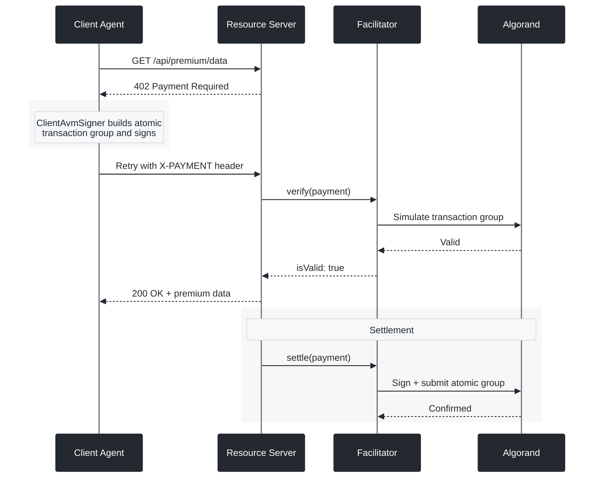
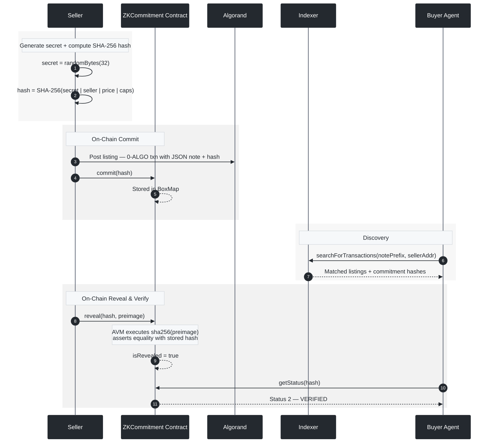
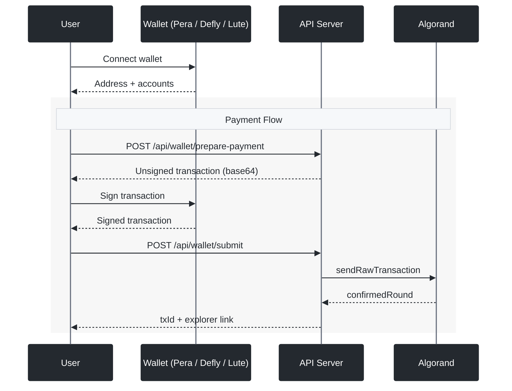
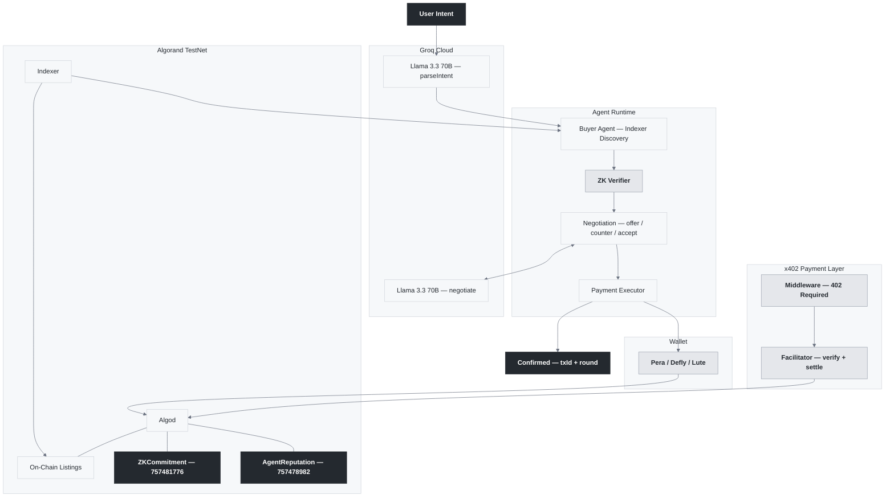

<div align="center">

<br/>

<picture>
  <source media="(prefers-color-scheme: dark)" srcset="https://img.shields.io/badge/A2A-Agentic_Commerce-white?style=for-the-badge&labelColor=000000">
  
</picture>

<br/><br/>

# Autonomous Agents. On-Chain Verification. Real Payments.

<br/>

AI agents discover services on the Algorand blockchain, verify seller authenticity<br/>
through on-chain SHA-256, negotiate prices with LLMs, and execute real ALGO payments.<br/>
**Zero human intervention.**

<br/>

<p>
  <a href="https://lora.algokit.io/testnet/application/757481776"></a>
  &nbsp;&nbsp;
  <a href="https://lora.algokit.io/testnet/application/757478982"></a>
</p>

<p>
  
  
  
  
  
  
</p>

<br/>

```
npx tsx scripts/run.ts "Buy cloud storage under 1 ALGO"
```

<br/>

---

</div>

<br/>

## Overview

Every digital purchase today — cloud storage, API access, compute — requires a human to search, compare, and pay. **A2A Agentic Commerce** removes that bottleneck entirely:

```mermaid
%%{init: {'theme': 'base', 'themeVariables': {'primaryColor': '#24292f', 'primaryTextColor': '#24292f', 'primaryBorderColor': '#d1d5db', 'lineColor': '#6b7280', 'secondaryColor': '#f6f8fa', 'tertiaryColor': '#f6f8fa', 'background': '#ffffff', 'mainBkg': '#f6f8fa', 'nodeBorder': '#d1d5db', 'clusterBkg': '#f6f8fa', 'clusterBorder': '#d1d5db', 'titleColor': '#24292f', 'edgeLabelBackground': '#ffffff', 'textColor': '#24292f'}}}%%

flowchart LR
    A["<b>User Intent</b><br/><i>Natural language</i>"]:::node
    B["<b>AI Parse</b><br/><i>Groq Llama 3.3</i>"]:::node
    C["<b>Discover</b><br/><i>Algorand Indexer</i>"]:::node
    D["<b>ZK Verify</b><br/><i>On-chain SHA-256</i>"]:::accent
    E["<b>Negotiate</b><br/><i>LLM-powered</i>"]:::node
    F["<b>Pay</b><br/><i>Real ALGO</i>"]:::accent

    A --> B --> C --> D --> E --> F

    classDef node fill:#f6f8fa,stroke:#d1d5db,color:#24292f,font-size:13px
    classDef accent fill:#24292f,stroke:#24292f,color:#ffffff,font-size:13px
```



<br/>

---

<br/>

## What Makes This Different

<table>
<tr>
<td width="25%" align="center">

**x402 Protocol**

Agents pay for premium API endpoints via HTTP 402 — automatic signing, on-chain settlement via [GoPlausible facilitator](https://x402.goplausible.xyz/). Not a simulation.

</td>
<td width="25%" align="center">

**On-Chain ZK**

SHA-256 verification runs inside the AVM via a [deployed contract](https://lora.algokit.io/testnet/application/757481776). The blockchain enforces the proof, not client JavaScript.

</td>
<td width="25%" align="center">

**Wallet-Native**

Pera, Defly, Lute. Server builds unsigned txns, wallet signs client-side. Private keys never touch the server.

</td>
<td width="25%" align="center">

**Real Transactions**

Every listing, commitment, and payment is a confirmed Algorand transaction. Verifiable `txId` and round number.

</td>
</tr>
</table>

<br/>

---

<br/>

## Live Smart Contracts

> Both contracts are deployed and operational on Algorand TestNet. Click to inspect on Lora Explorer.

<br/>

<table>
<tr>
<td width="50%">

### [`ZKCommitment`](https://lora.algokit.io/testnet/application/757481776) &nbsp; `App 757481776`

On-chain commit-reveal-verify scheme. The AVM's native `sha256` opcode recomputes hashes and asserts correctness — trustless verification enforced at the protocol level.

```
commit(hash)            → Store SHA-256 hash in BoxMap
reveal(hash, preimage)  → AVM runs sha256(preimage), asserts match
getStatus(hash)         → 0: not found | 1: committed | 2: verified
```

<sub>
<a href="contracts/ZKCommitment.algo.ts">View Source</a> · <a href="contracts/artifacts/zk_commitment/ZKCommitment.approval.teal">View TEAL</a> · <a href="https://lora.algokit.io/testnet/application/757481776">Explorer ↗</a>
</sub>

</td>
<td width="50%">

### [`AgentReputation`](https://lora.algokit.io/testnet/application/757478982) &nbsp; `App 757478982`

ERC-8004 inspired reputation registry. Tracks agent scores, feedback counts, and active status in BoxMap storage — no user opt-in required.

```
registerAgent()              → Create agent profile on-chain
submitFeedback(agent, score) → Submit 0-100 rating
getReputation(agent)         → Computed reputation score
```

<sub>
<a href="contracts/AgentReputation.algo.ts">View Source</a> · <a href="contracts/artifacts/agent_reputation/AgentReputation.approval.teal">View TEAL</a> · <a href="https://lora.algokit.io/testnet/application/757478982">Explorer ↗</a>
</sub>

</td>
</tr>
</table>

<br/>

---

<br/>

## x402 Payment Protocol

Real integration with the [x402 HTTP payment standard](https://x402.goplausible.xyz/) — developed by Coinbase, extended to Algorand by GoPlausible. This is how autonomous agents pay for services: HTTP-native, zero human approval.

<br/>



<br/>

| Package | What It Does |
|:--------|:-------------|
| `@x402-avm/core` | Client, server, and facilitator primitives |
| `@x402-avm/avm` | Algorand exact payment scheme, CAIP-2 network identifiers |
| `@x402-avm/fetch` | `wrapFetchWithPayment()` — transparently handles 402 responses |
| [`facilitator.goplausible.xyz`](https://facilitator.goplausible.xyz) | Public TestNet facilitator for payment settlement |

<br/>

---

<br/>

## On-Chain ZK Verification

The commitment scheme is **enforced by the blockchain**, not by client code. The AVM executes `sha256` natively inside the [`ZKCommitment`](https://lora.algokit.io/testnet/application/757481776) contract.

<br/>



<br/>

| Property | Guarantee |
|:---------|:----------|
| **Binding** | Seller cannot change claims post-commit — SHA-256 collision resistance |
| **Hiding** | On-chain hash reveals nothing without the 32-byte random nonce |
| **Trustless** | Verification runs inside the AVM, not trusted client code |

<br/>

---

<br/>

## Wallet Integration

Server prepares unsigned transactions. Wallet signs client-side. No private keys on the server.

<br/>



<br/>

| Wallet | Type | Integration |
|:-------|:-----|:------------|
| **[Pera](https://perawallet.app/)** | Mobile + Web | Most popular Algorand wallet |
| **[Defly](https://defly.app/)** | Mobile | DeFi-focused, portfolio tracking |
| **[Lute](https://lute.app/)** | Browser extension | Desktop-first experience |

<sub>Powered by <code>@txnlab/use-wallet-react</code> v4</sub>

<br/>

---

<br/>

## Architecture



<br/>

---

<br/>

## Pipeline

| # | Stage | Description |
|:--|:------|:------------|
| 1 | **Connect** | Initialize Algorand client (TestNet via Algonode) |
| 2 | **Post Listings** | Sellers publish 0-ALGO self-txns with JSON notes + SHA-256 commitment |
| 3 | **ZK Commit** | Commitment hashes registered on [`ZKCommitment`](https://lora.algokit.io/testnet/application/757481776) contract |
| 4 | **AI Intent** | Groq Llama 3.3 70B parses natural language → structured intent |
| 5 | **Indexer Discovery** | Query Algorand Indexer by `notePrefix` + seller address |
| 6 | **Negotiate** | AI-powered `offer → counter → accept` with concession logic |
| 7 | **ZK Reveal** | Seller reveals preimage → AVM verifies on-chain via [`sha256`](https://lora.algokit.io/testnet/application/757481776) |
| 8 | **Execute Payment** | Real ALGO transfer → `txId` + `confirmedRound` |
| 9 | **x402** | Premium endpoint settlement details |

<br/>

---

<br/>

## Tech Stack

| Technology | Purpose |
|:-----------|:--------|
| **Algorand TestNet** | Blockchain — listings, payments, ZK verification |
| **PuyaTs → TEAL** | Smart contract compilation (Algorand TypeScript) |
| **x402-avm** | HTTP 402 payment protocol + fee abstraction |
| **Pera · Defly · Lute** | Wallet authentication via `use-wallet` v4 |
| **Groq Llama 3.3 70B** | Intent parsing + negotiation AI |
| **Algorand Indexer** | On-chain listing discovery |
| **algosdk v3 · algokit-utils v8** | Transaction building + account management |
| **Next.js 15 · React 19 · Tailwind 4** | Frontend + API routes |
| **TypeScript 5.8** | End-to-end strict type safety |

<br/>

---

<br/>

## Quick Start

**Prerequisites**: Node.js 18+ · AlgoKit CLI (`pipx install algokit`)

```bash
git clone https://github.com/ogsamrat/a2a-ecommerce.git
cd a2a-ecommerce && npm install
cp .env.example .env
```

Configure `.env`:

```env
GROQ_API_KEY=your_key                    # console.groq.com
ALGORAND_NETWORK=testnet
AVM_PRIVATE_KEY=your_base64_key          # For x402 premium endpoint signing
FACILITATOR_URL=https://facilitator.goplausible.xyz
REPUTATION_APP_ID=757478982
ZK_APP_ID=757481776
```

> Fund your TestNet account: [lora.algokit.io/testnet/fund](https://lora.algokit.io/testnet/fund)

**Terminal** (full pipeline):
```bash
npx tsx scripts/run.ts "Buy cloud storage under 1 ALGO"
```

**Web app** (with wallet auth):
```bash
npx next dev
```

Open [localhost:3000](http://localhost:3000) — connect Pera, Defly, or Lute.

<br/>

---

<br/>

## API Reference

**17 endpoints** for frontend integration. Full docs with request/response examples in [`API_GUIDE.md`](API_GUIDE.md).

| Category | Endpoints | Auth |
|:---------|:----------|:-----|
| **Wallet** | `/api/wallet/info` · `prepare-payment` · `submit` | Wallet address |
| **Listings** | `/api/listings/fetch` · `create` | None / Wallet |
| **Reputation** | `/api/reputation/query` · `register` · `feedback` | None / Wallet |
| **Commerce** | `/api/intent` · `discover` · `negotiate` · `execute` · `init` | Server |
| **Premium** | `/api/premium/data` · `analyze` | x402 payment |

<br/>

---

<br/>

## Project Structure

```
contracts/
├── ZKCommitment.algo.ts              # On-chain SHA-256 commit/reveal/verify
├── AgentReputation.algo.ts           # ERC-8004 reputation registry
└── artifacts/                        # Compiled TEAL + ARC-56 specs

scripts/
├── run.ts                            # Full A2A pipeline demo
├── deploy-zk.ts                      # Deploy ZKCommitment
└── deploy-reputation.ts              # Deploy AgentReputation

src/app/api/                          # 17 Next.js API routes
src/components/                       # Wallet provider, connect UI, chat, cards
src/lib/
├── blockchain/                       # Algorand client, Indexer, ZK helpers
├── agents/                           # Buyer + seller agent logic
├── ai/                               # Groq LLM integration
├── negotiation/                      # Multi-round engine
└── x402/                             # x402 server + client wrappers
```

<br/>

---

<br/>

## Roadmap

- [x] On-chain service listings (0-ALGO transactions)
- [x] Algorand Indexer discovery (no off-chain DB)
- [x] **On-chain ZK** — [`ZKCommitment`](https://lora.algokit.io/testnet/application/757481776) deployed on TestNet
- [x] **Agent reputation** — [`AgentReputation`](https://lora.algokit.io/testnet/application/757478982) deployed on TestNet
- [x] **x402 protocol** — payment-gated premium endpoints
- [x] **Wallet auth** — Pera · Defly · Lute
- [x] AI negotiation — Groq Llama 3.3 70B
- [x] 17 API endpoints + [`API_GUIDE.md`](API_GUIDE.md)
- [ ] Full frontend dashboard
- [ ] Multi-agent parallel negotiation
- [ ] MainNet deployment

<br/>

---

<div align="center">

<br/>

**Built on [Algorand](https://algorand.co)** — 3.3s finality · <$0.001 fees · carbon negative

<sub>x402 Payment Protocol &nbsp;·&nbsp; On-Chain ZK Verification &nbsp;·&nbsp; Groq AI &nbsp;·&nbsp; Wallet-Native</sub>

<br/>

</div>
